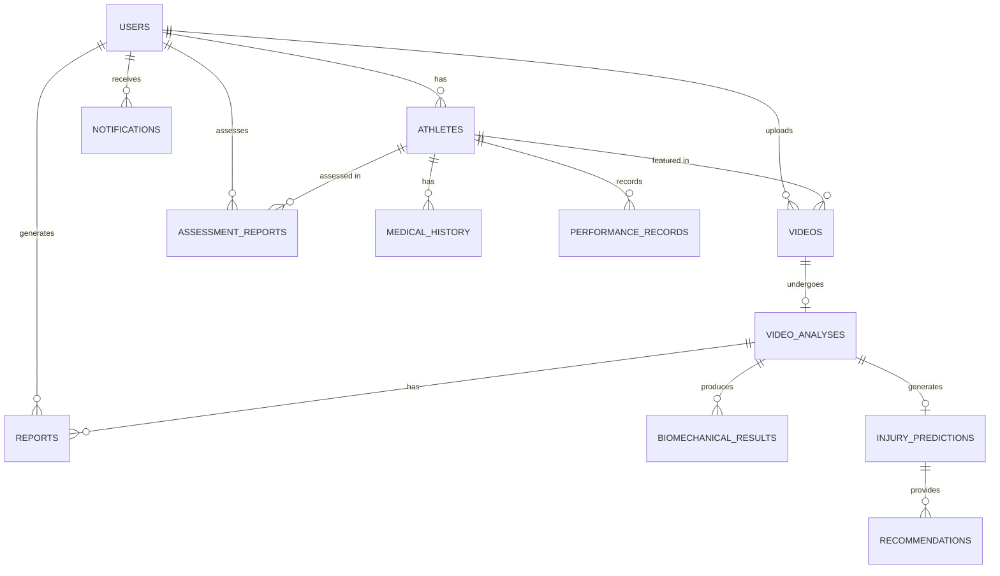

```mermaid
erDiagram
    USERS ||--o{ ATHLETES : "has"
    USERS ||--o{ VIDEOS : "uploads"
    USERS ||--o{ NOTIFICATIONS : "receives"
    USERS ||--o{ REPORTS : "generates"
    USERS ||--o{ ASSESSMENT_REPORTS : "assesses"
    
    ATHLETES ||--o{ MEDICAL_HISTORY : "has"
    ATHLETES ||--o{ VIDEOS : "featured in"
    ATHLETES ||--o{ PERFORMANCE_RECORDS : "records"
    ATHLETES ||--o{ ASSESSMENT_REPORTS : "assessed in"
    
    VIDEOS ||--o| VIDEO_ANALYSES : "undergoes"
    
    VIDEO_ANALYSES ||--o{ BIOMECHANICAL_RESULTS : "produces"
    VIDEO_ANALYSES ||--o| INJURY_PREDICTIONS : "generates"
    VIDEO_ANALYSES ||--o{ REPORTS : "has"
    
    INJURY_PREDICTIONS ||--o{ RECOMMENDATIONS : "provides"
```
