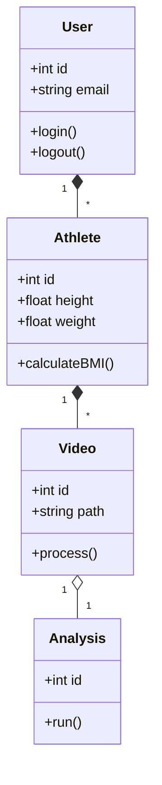

```mermaid
classDiagram
    class User {
        +int id
        +string email
        +login()
        +logout()
    }
    class Athlete {
        +int id
        +float height
        +float weight
        +calculateBMI()
    }
    class Video {
        +int id
        +string path
        +process()
    }
    class Analysis {
        +int id
        +run()
    }
    User "1" *-- "*" Athlete
    Athlete "1" *-- "*" Video
    Video "1" o-- "1" Analysis
```
