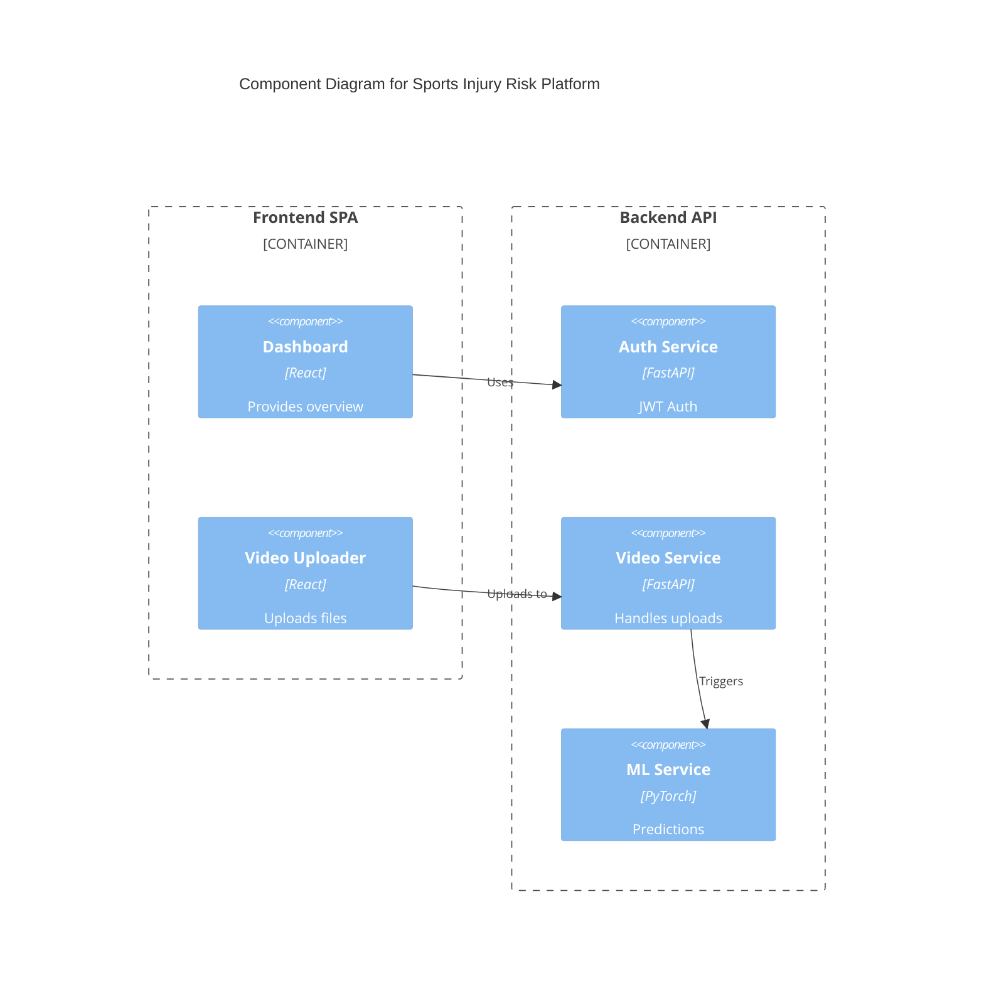

```mermaid
C4Component
    title Component Diagram for Sports Injury Risk Platform
    
    Container_Boundary(frontend, "Frontend SPA") {
        Component(dash, "Dashboard", "React", "Provides overview")
        Component(vid, "Video Uploader", "React", "Uploads files")
    }
    
    Container_Boundary(backend, "Backend API") {
        Component(auth, "Auth Service", "FastAPI", "JWT Auth")
        Component(video, "Video Service", "FastAPI", "Handles uploads")
        Component(ml, "ML Service", "PyTorch", "Predictions")
    }
    
    Rel(dash, auth, "Uses")
    Rel(vid, video, "Uploads to")
    Rel(video, ml, "Triggers")
```
