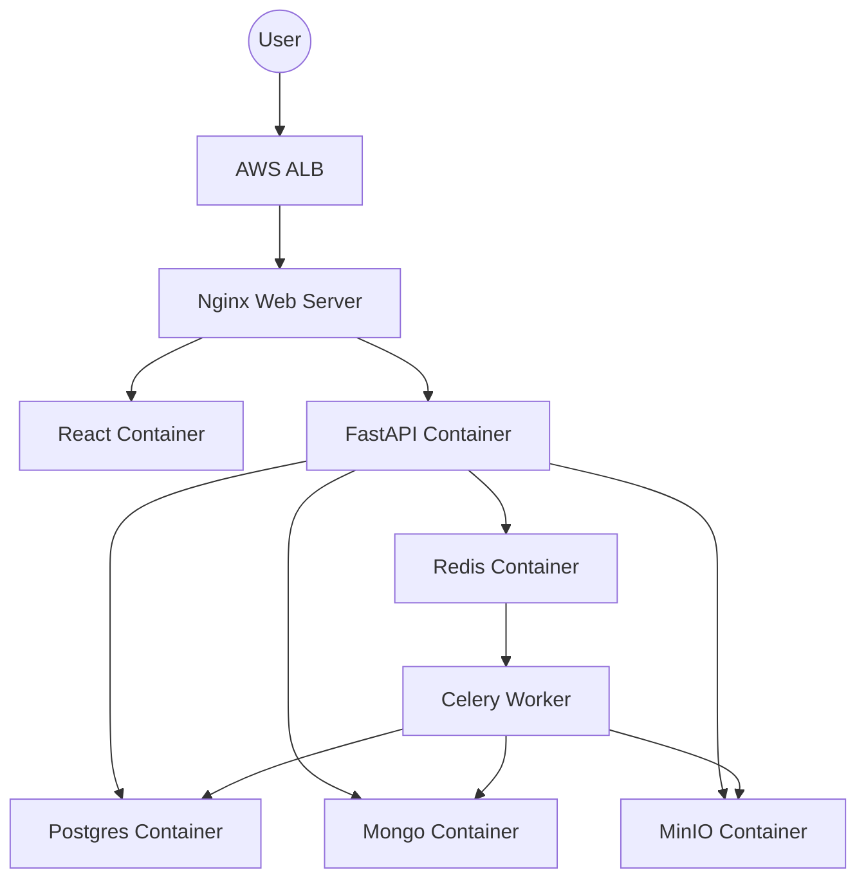

```mermaid
graph TD
    User((User)) --> ALB[AWS ALB]
    ALB --> Web[Nginx Web Server]
    Web --> Frontend[React Container]
    Web --> Backend[FastAPI Container]
    Backend --> Redis[Redis Container]
    Backend --> PG[Postgres Container]
    Backend --> Mongo[Mongo Container]
    Backend --> Minio[MinIO Container]
    Redis --> Worker[Celery Worker]
    Worker --> PG
    Worker --> Mongo
    Worker --> Minio
```
