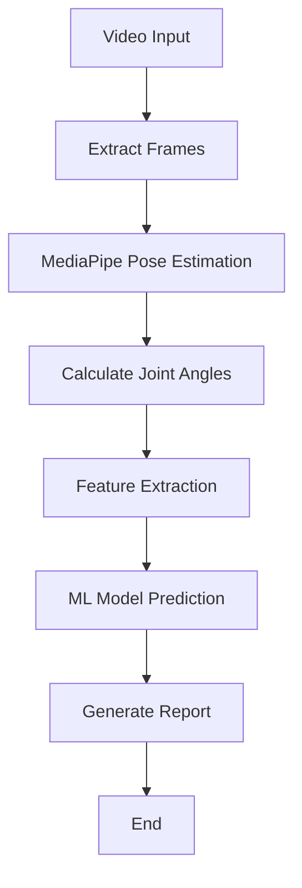

```mermaid
graph TD
    A[Video Input] --> B[Extract Frames]
    B --> C[MediaPipe Pose Estimation]
    C --> D[Calculate Joint Angles]
    D --> E[Feature Extraction]
    E --> F[ML Model Prediction]
    F --> G[Generate Report]
    G --> H[End]
```
