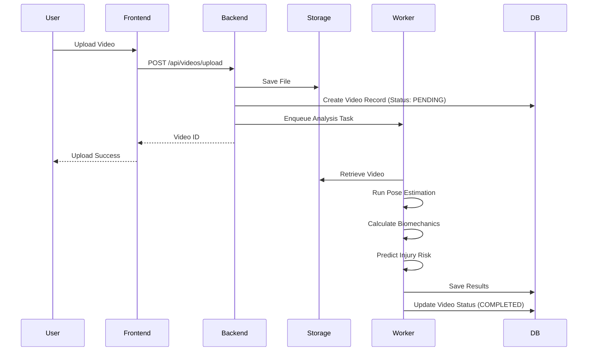

```mermaid
sequenceDiagram
    participant User
    participant Frontend
    participant Backend
    participant Storage
    participant Worker
    participant DB
    
    User->>Frontend: Upload Video
    Frontend->>Backend: POST /api/videos/upload
    Backend->>Storage: Save File
    Backend->>DB: Create Video Record (Status: PENDING)
    Backend->>Worker: Enqueue Analysis Task
    Backend-->>Frontend: Video ID
    Frontend-->>User: Upload Success
    
    Worker->>Storage: Retrieve Video
    Worker->>Worker: Run Pose Estimation
    Worker->>Worker: Calculate Biomechanics
    Worker->>Worker: Predict Injury Risk
    Worker->>DB: Save Results
    Worker->>DB: Update Video Status (COMPLETED)
```
