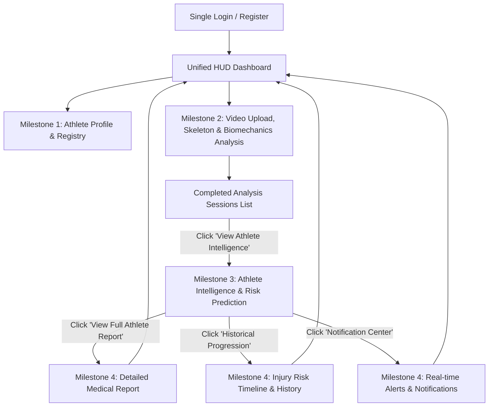

# Sports Injury Risk — Unified Multi-Milestone Integration & Verification

## Overview

All 4 Milestones (**Milestone 1**, **Milestone 2**, **Milestone 3**, and **Milestone 4**) have been unified into **ONE single application** accessible at `http://localhost:5173/` backed by a unified FastAPI server at `http://localhost:8000/`.

---

## Target User Flow (Fully Implemented & Verified)

---

## Key Architecture & Integration Highlights

1. **Single Entrypoint (`http://localhost:5173/`)**:
   - Single sign-on with persistent JWT token management via `frontend/src/utils/api.js`.
   - Dynamic lazy-loaded routing for M3 and M4 components in `App.jsx`:
     - `/milestone3/analysis/:sessionId` &rarr; [`AthleteIntelligence.jsx`](file:///c:/Users/Nagaveni/OneDrive/Desktop/Sports%20injury/sports-injury-risk/milestone3/frontend/pages/AthleteIntelligence.jsx)
     - `/milestone4/report/:sessionId` &rarr; [`AthleteReport.jsx`](file:///c:/Users/Nagaveni/OneDrive/Desktop/Sports%20injury/sports-injury-risk/milestone4/frontend/pages/AthleteReport.jsx)
     - `/milestone4/history/:athleteId` &rarr; [`AnalysisHistory.jsx`](file:///c:/Users/Nagaveni/OneDrive/Desktop/Sports%20injury/sports-injury-risk/milestone4/frontend/pages/AnalysisHistory.jsx)
     - `/milestone4/notifications/:athleteId` &rarr; [`Notifications.jsx`](file:///c:/Users/Nagaveni/OneDrive/Desktop/Sports%20injury/sports-injury-risk/milestone4/frontend/pages/Notifications.jsx)

2. **Unified Backend Engine (`http://localhost:8000/`)**:
   - FastAPI server mounting all 38 endpoints across all 4 milestones simultaneously.
   - Python namespace resolution cleanly linking Milestone 3 & Milestone 4 routers, schemas, and models.
   - Dynamic session ownership validation supporting both Coach/Admin roles and Athlete user ownership.
   - Safe type coercion for ACWR / training load metrics during real-time intelligence calculation.

3. **Dashboard Real Data Stream**:
   - Added `GET /milestone2/analysis/sessions` to dynamically retrieve real analysis sessions from MongoDB.
   - Dashboard provides direct action buttons:
     - **"View Athlete Intelligence"** (M3)
     - **"View Report"** (M4)
     - **"Risk History"** (M4)
     - **"Notifications"** (M4)

---

## Verification Results

| Milestone Component | Endpoint / Route | Verification Result |
| :--- | :--- | :--- |
| **Milestone 1 Auth** | `POST /login` & `GET /me` | **PASS (200 OK)** — JWT generated & role validated |
| **Milestone 2 Sessions** | `GET /milestone2/analysis/sessions` | **PASS (200 OK)** — Real session list loaded from DB |
| **Milestone 3 Intelligence** | `GET /milestone3/analysis/{session_id}` | **PASS (200 OK)** — 505 anomalies detected, 6 risks predicted, composite score computed |
| **Milestone 4 Report** | `POST /milestone4/reports/{session_id}/generate` | **PASS (201 Created)** — Comprehensive report generated and cached |
| **Milestone 4 History** | `GET /milestone4/history/{athlete_id}` | **PASS (200 OK)** — Historical trend points retrieved |
| **Milestone 4 Alerts** | `GET /milestone4/notifications/{athlete_id}` | **PASS (200 OK)** — Alerts and notifications list retrieved |
| **Frontend Production Build** | `npm run build` | **PASS** — 0 errors, all chunks bundled in 3.54s |
