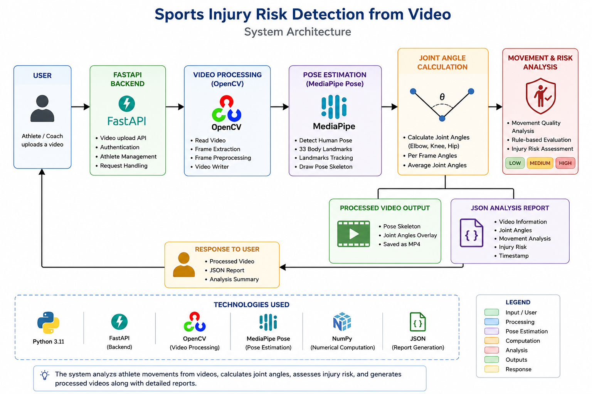
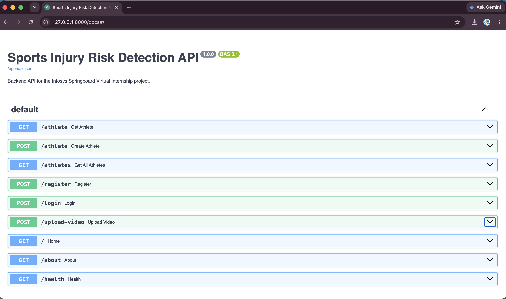
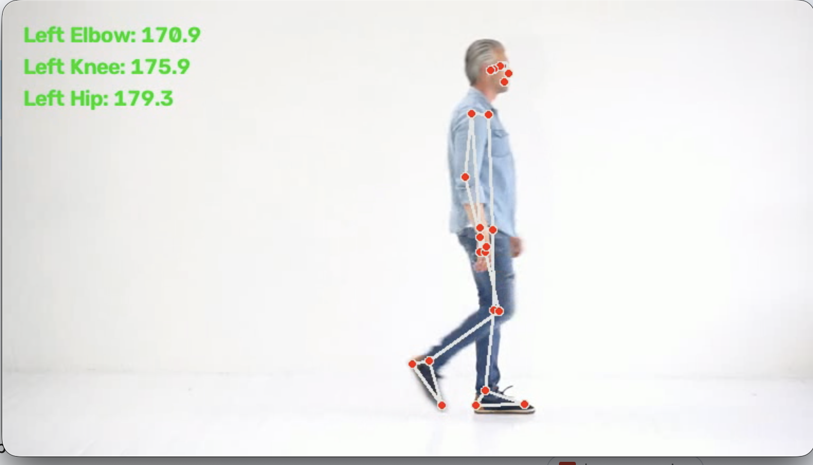
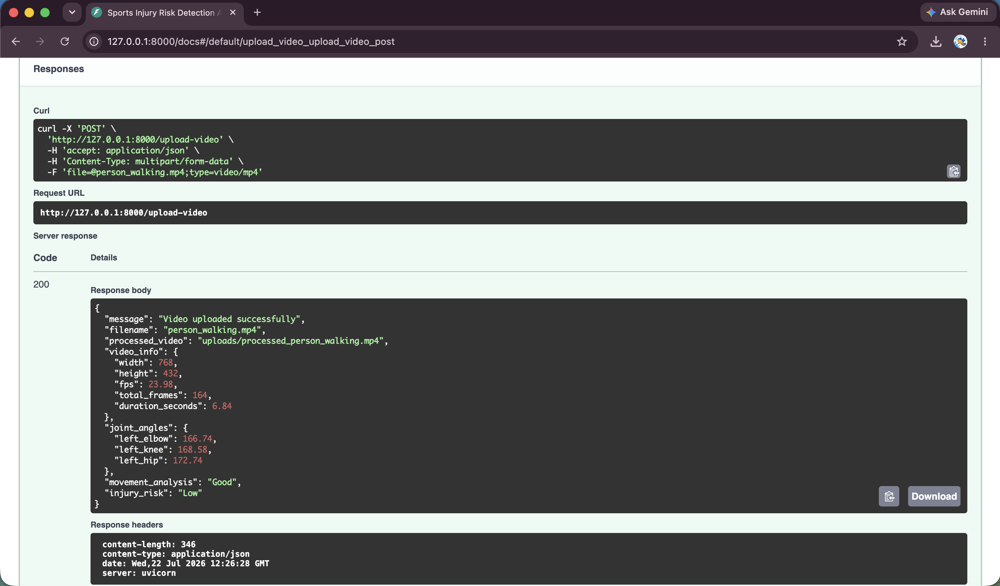

# Sports Injury Risk Detection from Video

A computer vision–based application developed as part of the **Infosys Springboard Virtual Internship**. The system analyzes an athlete's movement from an uploaded video using **MediaPipe Pose** and **OpenCV**, calculates biomechanical joint angles, evaluates movement quality, predicts potential injury risks, detects movement anomalies, generates personalized recommendations, and provides a dashboard-ready analysis through REST APIs built with **FastAPI**.

---

# Project Overview

Sports injuries often result from poor movement mechanics, incorrect posture, or repetitive motion. This project aims to assist athletes and coaches by automatically analyzing movement videos and identifying possible injury risks.

The application processes uploaded videos frame by frame, detects body landmarks, calculates joint angles, performs movement analysis, predicts injury risks using rule-based logic, and generates structured reports that can be integrated into future web dashboards.

---

# Objectives

- Analyze athlete movements from uploaded videos
- Detect human body landmarks using MediaPipe Pose
- Calculate biomechanical joint angles
- Evaluate movement quality
- Predict potential injury risks
- Detect movement anomalies
- Generate personalized corrective recommendations
- Calculate an overall movement risk score
- Generate structured JSON reports
- Provide REST APIs for frontend integration

---

# Project Features

## Milestone 1

- FastAPI backend setup
- User registration
- User authentication
- Athlete management APIs
- Swagger API documentation

---

## Milestone 2

- Video upload API
- OpenCV video processing
- Human pose detection using MediaPipe
- Joint angle calculation
- Average joint angle computation
- Movement quality analysis
- Injury risk assessment
- Processed video generation
- JSON report generation

---

## Milestone 3

- Injury Risk Prediction Engine
- Movement Anomaly Detection
- Risk Scoring Model
- Corrective Recommendation Engine
- Athlete Intelligence Dashboard API

---

# Technology Stack

| Category | Technologies |
|-----------|--------------|
| Programming Language | Python 3.11 |
| Backend Framework | FastAPI |
| Server | Uvicorn |
| Computer Vision | OpenCV |
| Pose Estimation | MediaPipe Pose |
| Numerical Computing | NumPy |
| Data Format | JSON |
| Version Control | Git |
| Repository | GitHub |

---

# Project Structure

```text
Sports-Injury-Risk-/
│
├── backend/
│
│   ├── main.py
│   ├── requirements.txt
│
│   ├── models/
│   │     └── athlete.py
│   │
│   ├── routes/
│   │     ├── auth_routes.py
│   │     ├── athlete_routes.py
│   │     ├── video_routes.py
│   │     └── dashboard_routes.py
│   │
│   ├── services/
│   │     ├── pose_service.py
│   │     ├── angle_service.py
│   │     ├── risk_service.py
│   │     ├── prediction_service.py
│   │     ├── anomaly_service.py
│   │     ├── scoring_service.py
│   │     ├── recommendation_service.py
│   │     └── report_service.py
│   │
│   ├── uploads/
│   ├── utils/
│
├── docs/
│   └── images/
│
├── README.md
└── LICENSE
```

---

# System Workflow

```text
Athlete Video
      │
      ▼
Video Upload API
      │
      ▼
OpenCV Video Processing
      │
      ▼
MediaPipe Pose Detection
      │
      ▼
Joint Angle Calculation
      │
      ▼
Movement Quality Analysis
      │
      ▼
Injury Risk Prediction
      │
      ▼
Movement Anomaly Detection
      │
      ▼
Risk Scoring
      │
      ▼
Corrective Recommendation Engine
      │
      ▼
JSON Report Generation
      │
      ▼
Athlete Intelligence Dashboard API
```

---

# System Architecture



---

# Installation

## Clone the Repository

```bash
git clone https://github.com/springboardmentor1234r/Sports-Injury-Risk-.git
```

## Navigate to the Backend

```bash
cd Sports-Injury-Risk-/backend
```

## Create a Conda Environment

```bash
conda create -n sports-injury python=3.11
```

## Activate the Environment

```bash
conda activate sports-injury
```

## Install Dependencies

```bash
pip install -r requirements.txt
```

## Run the Application

```bash
python -m uvicorn main:app --reload
```

Open Swagger API documentation:

```text
http://127.0.0.1:8000/docs
```

---

# API Endpoints

## General

| Method | Endpoint | Description |
|---------|----------|-------------|
| GET | `/` | Home API |
| GET | `/about` | Project information |
| GET | `/health` | Server health status |

---

## Authentication

| Method | Endpoint | Description |
|---------|----------|-------------|
| POST | `/register` | Register a new user |
| POST | `/login` | User authentication |

---

## Athlete Management

| Method | Endpoint | Description |
|---------|----------|-------------|
| GET | `/athletes` | Retrieve athlete details |
| POST | `/athletes` | Add a new athlete |

---

## Video Analysis

| Method | Endpoint | Description |
|---------|----------|-------------|
| POST | `/upload-video` | Upload and analyze athlete video |

---

## Dashboard

| Method | Endpoint | Description |
|---------|----------|-------------|
| GET | `/dashboard` | Athlete intelligence dashboard |

---

# Processing Pipeline

The uploaded athlete video passes through the following stages:

1. Upload video
2. Read video using OpenCV
3. Detect body landmarks using MediaPipe Pose
4. Calculate elbow, knee, and hip joint angles
5. Compute average joint angles
6. Analyze movement quality
7. Predict injury risks
8. Detect movement anomalies
9. Calculate overall movement risk score
10. Generate personalized recommendations
11. Generate processed video
12. Generate JSON report
13. Display dashboard-ready analysis

---

# Sample API Response

```json
{
    "message": "Video uploaded successfully",
    "joint_angles": {
        "left_elbow": 166.74,
        "left_knee": 168.58,
        "left_hip": 172.74
    },
    "movement_analysis": "Good",
    "injury_prediction": {
        "acl_risk": "Low",
        "hamstring_risk": "Low",
        "ankle_sprain_risk": "Low",
        "shoulder_risk": "Low",
        "lower_back_risk": "Low"
    },
    "movement_anomalies": [
        {
            "joint": "Overall",
            "severity": "None",
            "issue": "No significant movement anomalies detected",
            "recommendation": "Maintain current movement pattern."
        }
    ],
    "risk_score": {
        "overall_score": 100,
        "risk_level": "Low"
    },
    "recommendations": [
        "Excellent movement pattern. Continue your current training routine and maintain proper warm-up and stretching."
    ],
    "report": "uploads/person_walking_report.json"
}
```

---

# Project Screenshots

### API Documentation



### Processed Video



### JSON Report



### System Workflow


---

# Current Capabilities

- Athlete management
- User authentication
- Video upload and processing
- Pose estimation
- Joint angle calculation
- Movement quality analysis
- Injury risk prediction
- Movement anomaly detection
- Risk scoring
- Personalized recommendations
- Dashboard API
- JSON report generation

---

# Future Enhancements

- Machine Learning–based injury prediction
- Deep Learning pose estimation
- Real-time webcam analysis
- Athlete performance history
- Exercise recognition
- React frontend dashboard
- JWT authentication
- Database integration
- Docker support
- Cloud deployment
- PDF report generation
- Performance analytics

---

# Developer

**Sejal Chintala**

Bachelor of Technology (Computer Science and Engineering – AIML)

Gandhi Institute of Technology

Infosys Springboard Virtual Internship

---

# Acknowledgements

- Infosys Springboard
- FastAPI
- OpenCV
- MediaPipe
- Python Community

---

# License

This project is developed for educational purposes as part of the Infosys Springboard Virtual Internship.